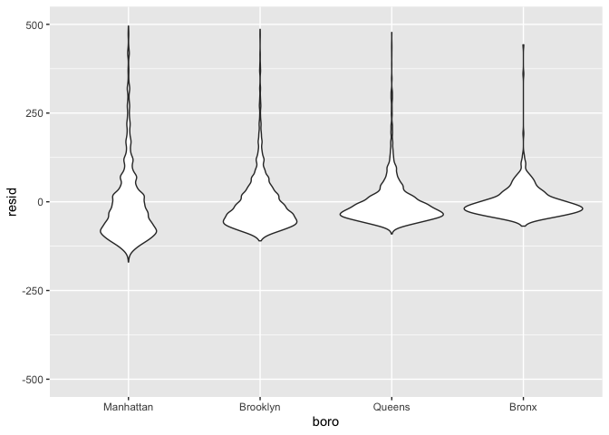
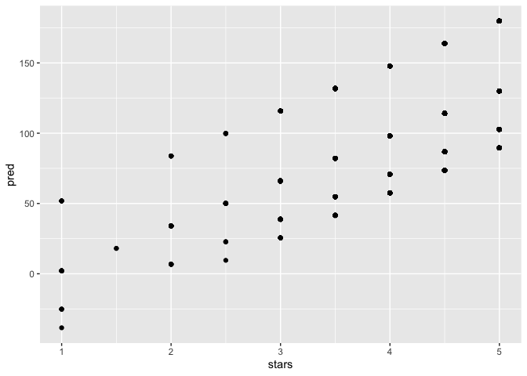

linear models
================
Duzhi Zhao
11/7/2019

# NYC airbnb dataset

``` r
data("nyc_airbnb")

nyc_airbnb = 
  nyc_airbnb %>% 
  mutate(stars = review_scores_location / 2) %>% 
  rename(
    boro = neighbourhood_group,
    neighborhood = neighbourhood) %>% 
  filter(boro != "Staten Island") %>% 
  select(price, stars, boro, neighborhood, room_type)
```

## Fit a first linear model

``` r
# Keeping boro fixed, how much price increases as one unit of stars increases
fit = lm(price ~ stars + boro, data = nyc_airbnb)
# if star goes up by one unit, price goes up by 31.99 dollars 

summary(fit)
```

    ## 
    ## Call:
    ## lm(formula = price ~ stars + boro, data = nyc_airbnb)
    ## 
    ## Residuals:
    ##    Min     1Q Median     3Q    Max 
    ## -169.8  -64.0  -29.0   20.2 9870.0 
    ## 
    ## Coefficients:
    ##               Estimate Std. Error t value Pr(>|t|)    
    ## (Intercept)    -70.414     14.021  -5.022 5.14e-07 ***
    ## stars           31.990      2.527  12.657  < 2e-16 ***
    ## boroBrooklyn    40.500      8.559   4.732 2.23e-06 ***
    ## boroManhattan   90.254      8.567  10.534  < 2e-16 ***
    ## boroQueens      13.206      9.065   1.457    0.145    
    ## ---
    ## Signif. codes:  0 '***' 0.001 '**' 0.01 '*' 0.05 '.' 0.1 ' ' 1
    ## 
    ## Residual standard error: 181.5 on 30525 degrees of freedom
    ##   (9962 observations deleted due to missingness)
    ## Multiple R-squared:  0.03423,    Adjusted R-squared:  0.03411 
    ## F-statistic: 270.5 on 4 and 30525 DF,  p-value: < 2.2e-16

``` r
coef(fit)
```

    ##   (Intercept)         stars  boroBrooklyn boroManhattan    boroQueens 
    ##     -70.41446      31.98989      40.50030      90.25393      13.20617

``` r
summary(fit)$coef
```

    ##                Estimate Std. Error   t value     Pr(>|t|)
    ## (Intercept)   -70.41446  14.020697 -5.022180 5.137589e-07
    ## stars          31.98989   2.527500 12.656733 1.269392e-36
    ## boroBrooklyn   40.50030   8.558724  4.732049 2.232595e-06
    ## boroManhattan  90.25393   8.567490 10.534465 6.638618e-26
    ## boroQueens     13.20617   9.064879  1.456850 1.451682e-01

## tidy the results instead\!

``` r
fit %>% 
  broom::tidy() %>% 
  mutate(term = str_replace(term, "boro", "Boro: ")) %>% 
  knitr::kable(digits = 3)
```

| term            | estimate | std.error | statistic | p.value |
| :-------------- | -------: | --------: | --------: | ------: |
| (Intercept)     | \-70.414 |    14.021 |   \-5.022 |   0.000 |
| stars           |   31.990 |     2.527 |    12.657 |   0.000 |
| Boro: Brooklyn  |   40.500 |     8.559 |     4.732 |   0.000 |
| Boro: Manhattan |   90.254 |     8.567 |    10.534 |   0.000 |
| Boro: Queens    |   13.206 |     9.065 |     1.457 |   0.145 |

## Take a look at factors

``` r
# Factor ordered based on frequency. 1: most frequent
nyc_airbnb = 
  nyc_airbnb %>% 
  mutate(
    boro = fct_infreq(boro),
    room_type = fct_infreq(room_type)
  )

# factor 1: most common ---- Manhattan
```

## Refit the last model

``` r
fit = lm(price~ stars + boro, data = nyc_airbnb)

# Now the reference category is the most frequent factor: Manhattan instead of Bronx
fit %>% 
  broom::tidy() %>% 
  mutate(term = str_replace(term, "boro", "Boro: "))
```

    ## # A tibble: 5 x 5
    ##   term           estimate std.error statistic   p.value
    ##   <chr>             <dbl>     <dbl>     <dbl>     <dbl>
    ## 1 (Intercept)        19.8     12.2       1.63 1.04e-  1
    ## 2 stars              32.0      2.53     12.7  1.27e- 36
    ## 3 Boro: Brooklyn    -49.8      2.23    -22.3  6.32e-109
    ## 4 Boro: Queens      -77.0      3.73    -20.7  2.58e- 94
    ## 5 Boro: Bronx       -90.3      8.57    -10.5  6.64e- 26

``` r
# p-value: is this regression coefficient significant?
```

## broom::glance()

``` r
# p-value here: F stats to the whole model
fit %>% 
  broom::glance()
```

    ## # A tibble: 1 x 11
    ##   r.squared adj.r.squared sigma statistic   p.value    df  logLik    AIC
    ##       <dbl>         <dbl> <dbl>     <dbl>     <dbl> <int>   <dbl>  <dbl>
    ## 1    0.0342        0.0341  182.      271. 6.73e-229     5 -2.02e5 4.04e5
    ## # … with 3 more variables: BIC <dbl>, deviance <dbl>, df.residual <int>

# Diagnostics

``` r
# The modelr package can be used to add residuals and fitted values to a dataframe.

# add the model info to the originial dataset
modelr::add_residuals(nyc_airbnb, fit) %>% 
  ggplot(aes(x = boro, y = resid)) +
  geom_violin() + 
  ylim(-500, 500)
```

    ## Warning: Removed 10202 rows containing non-finite values (stat_ydensity).

<!-- -->

``` r
modelr::add_residuals(nyc_airbnb, fit) %>% 
  ggplot(aes(x = stars, y = resid)) +
  geom_point() + 
  ylim(-500, 500)
```

    ## Warning: Removed 10202 rows containing missing values (geom_point).

<!-- -->

``` r
modelr::add_predictions(nyc_airbnb, fit) %>% 
  ggplot(aes(x = stars, y = pred)) +
  geom_point()
```

    ## Warning: Removed 9962 rows containing missing values (geom_point).

<!-- -->
